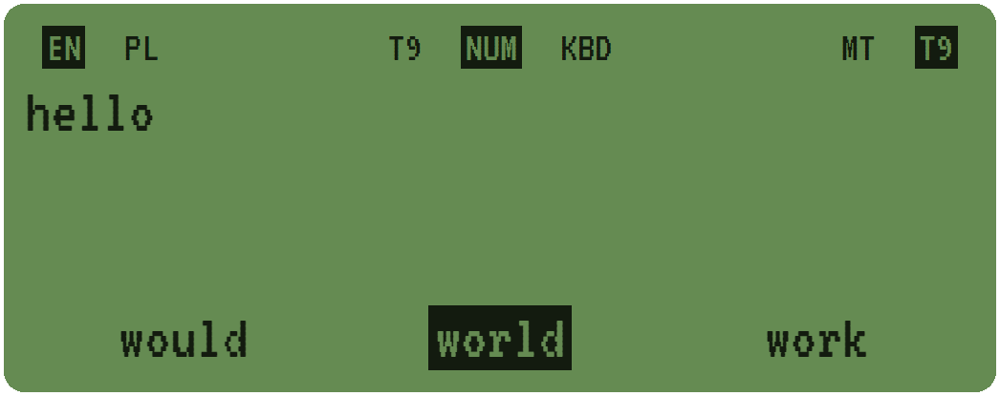
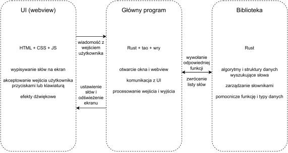

# [T9](https://en.wikipedia.org/wiki/T9_(predictive_text))

## Problem

Na urządzeniach z małą ilością klawiszy (jak n.p. telefonach komórkowych bez ekranu dotykowego) nie można każdej literze przyznać osobnego klawiszu. Problem ten można rozwiązać w dwa sposoby: Wymagać kilkurazowego kliknięcia klawisza dla różnych liter (metoda [multi-tap](https://en.wikipedia.org/wiki/Multi-tap)) lub zgadywanie litery na podstawie słownika (metoda [T9](https://en.wikipedia.org/wiki/T9_(predictive_text)) i podobne). Program ten implementuje obie te metody z możliwością przełączania między nimi.

## Architektura Programu

Program jest podzielony na 3 części:

- Interfejs użytkownika (w `assets`)
- Główny program (w `src/main.rs`)
- Biblioteka (w `src/lib.rs`)

Opisy głównych algorytmów i struktur danych znajdują się w osobnych plikach: `multitap.md`, `t9.md`, i `iterator.md`.

## Kompilacja i wykonanie

Wymagane są [Rust i Cargo](https://rustup.rs) w wersji 1.75 lub nowszej.

W katalogu projektu należy wykonać `cargo run` (lub `cargo run --release`) aby skompilować i wykonać program. Pierwsza kompilacja może zająć kilka minut, późniejsze wykonania powinne być o wiele szybsze.

Do kompilacji programu bez jego wykonania można użyć `cargo build` (lub `cargo build --release`). Skompilowany program będzie się znajdować w `target/debug/aisd[.exe]` lub `target/release/aisd[.exe]`.

Podczas kompilacji, wszystkie wymagane pliki są wpakowane do programu, więc do użycia skompilowanej wersji aplikacji potrzebny jest jedynie jej plik wykonywalny.

## Użycie

Do wpisania znaków można użyć przycisków na ekranie lub klawiatury. Przyciski pod ekranem zmieniają konfiguracje programu:

- `<` zmienia język (angielski lub polski) dla bieżącego słowa
- `◻` zmienia układ klawiszy (telefonowa, numpad, lub klawiatura)
- `>` zmienia metodę wejścia (multi-tap lub T9)

Aktualna konfiguracja jest wyświetlona na górze ekranu.
Przyciski na ekranie pokazują aktualny wybrany układ klawiszy.

Wpisanie znaku powoduje wyświetlenie na dole ekranu trzech możliwych słów do wybrania.
Aktualnie zaznaczone słowo może być wybrane przy pomocy klawisza `␣`, a następna możliwość może być zaznaczona przy pomocy klawisza `next`.
Wybrane słowa są dodane do tekstu wyświetlonego na ekranie.
Wpisane znaki lub słowa można usunąć używając klawisza `⌫`.

## Kod źródłowy

Katalog `assets` zawiera użyte przez program ikony (`icon.png`, `icon.svg`, `minicon.png`), źródła interfejsu użytkownika (`page.html`, `page.css`, `page.js`) oraz użyte czcionki (`*.woff2`).

Katalog `src` zawiera pliki źródłowe programu: `main.rs` inicjalizuje i komunikuje z interfejsem użytkownika, a `lib.rs` zawiera implementacje algorytmów, które przetwarzają wpisane przez użytkownika znaki. Dodatkowo w `src` znajdują się również słowniki (`words-en.txt` i `words-pl.txt`), które zawierają słowa w danym języku posortowane według popularności.

## Atrybucja

- Czcionka użyta do tekstu na wyświetlaczu to [*VT323*](https://fonts.google.com/specimen/VT323) (w `assets/vt323-*.woff2`), używana na warunkach [Open Font License](https://scripts.sil.org/cms/scripts/page.php?site_id=nrsi&id=OFL)
- Czcionka użyta w innych miejscach to [*Sarabun*](https://fonts.google.com/specimen/Sarabun) (w `assets/sarabun-*.woff2`), używana na warunkach [Open Font License](https://scripts.sil.org/cms/scripts/page.php?site_id=nrsi&id=OFL)
- Słowniki (w `src/words-*.txt`) pochodzą z <https://github.com/IlyaSemenov/wikipedia-word-frequency> i są oparte na danych z [Wikipedii](https://wikipedia.org). Listy są skrócone i zawierają tylko słowa użyte w co najmniej 100 artykułach, i są używane na warunkach licencji [MIT](https://github.com/IlyaSemenov/wikipedia-word-frequency/blob/3354c90d8cc1b4f53f4b57479d15da26d303fc69/LICENSE) i [CC BY-SA 4.0](https://creativecommons.org/licenses/by-sa/4.0/deed.pl)
